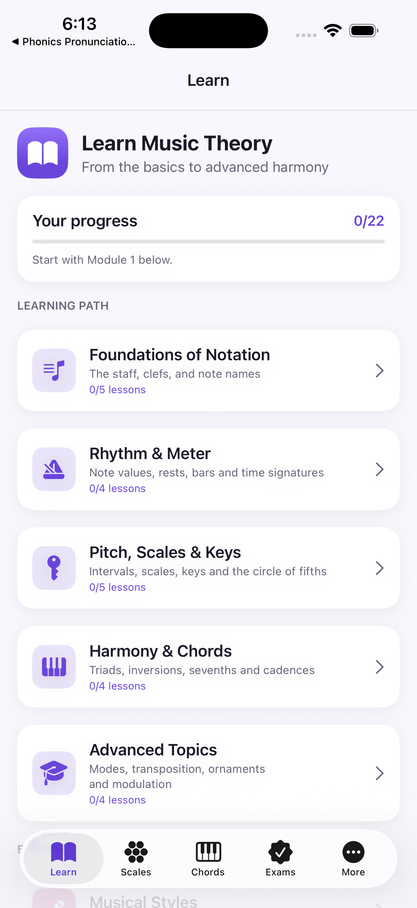
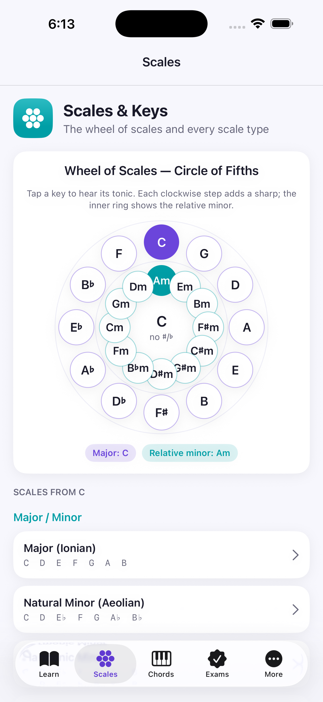
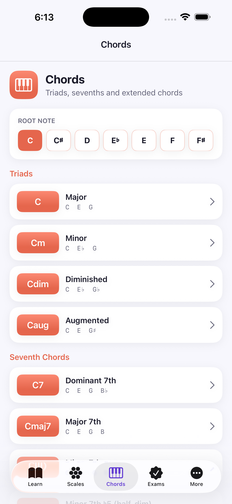
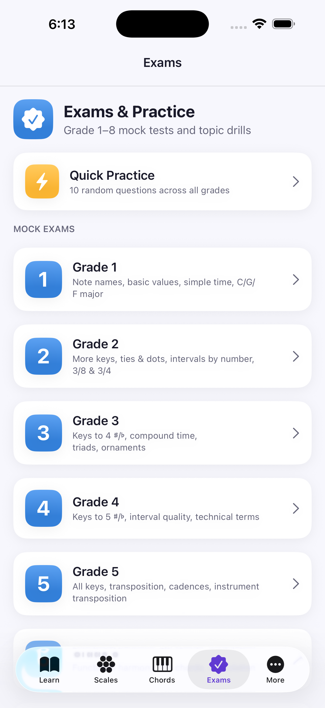
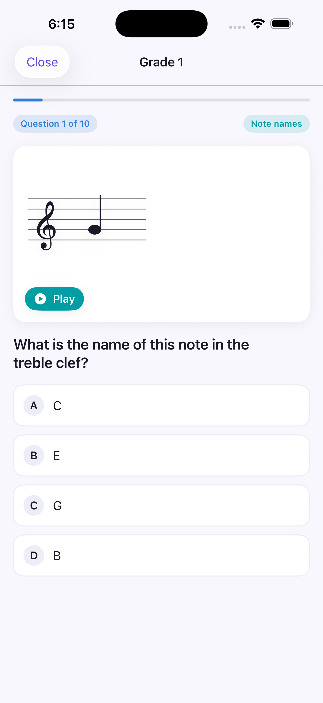
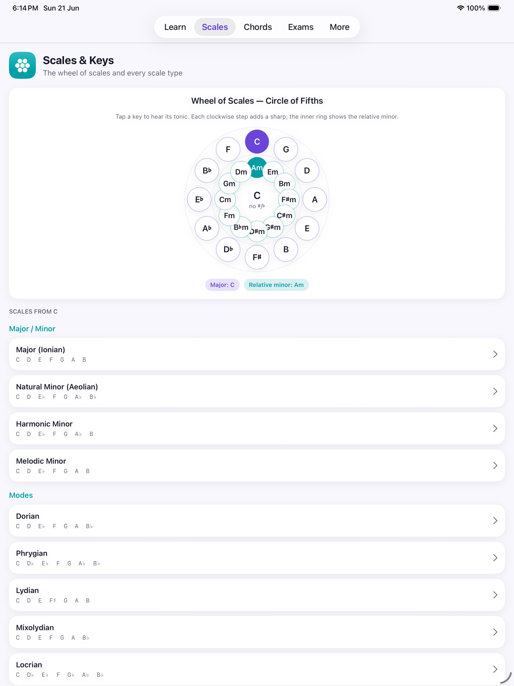

# 🎵 Music Theory Maestro

A complete **music-theory tutor for iPhone and iPad** — from reading the staff and clefs to
scales, the circle of fifths, chords, and the harmony behind jazz, blues and R&B. Practise with
**Grade 1–8 mock exams** and interactive, audible examples.




## ✨ Features

- **📖 Structured lessons (basic → advanced)** — five learning modules covering the staff & ledger
  lines, treble/bass clefs, note names, accidentals, rhythm, note values, bars & bar lines, time
  signatures, intervals, scales, key signatures, harmony, cadences, modes, transposition and
  modulation.
- **🎼 Real music-notation rendering** — a custom SwiftUI `Canvas` staff engine draws treble,
  bass and alto clefs, key signatures, time signatures, note values, ledger lines and stems — and
  **plays each example back**.
- **🛞 The Wheel of Scales** — an interactive **Circle of Fifths** showing all 12 major keys, their
  relative minors and accidental counts; tap any key to hear it.
- **🎹 Scale explorer** — major/minor, the seven modes, pentatonic, blues, whole-tone and chromatic
  scales in any key, with notes spelled correctly, shown on the staff and keyboard, and playable
  ascending/descending.
- **🎶 Chord library** — triads, seventh chords, extended/altered chords and suspended/added chords
  in any root, with formulas, staff, keyboard highlight and chord/arpeggio playback.
- **🎓 Grade 1–8 mock exams** — graded multiple-choice tests with notation-reading questions,
  instant explanations, scoring and best-score tracking, plus topic drills and quick mixed practice.
- **🎺 Musical styles** — how **jazz, blues, R&B/soul and classical** each apply theory, with
  signature chord progressions you can hear.
- **🔊 Built-in synth** — a lightweight `AVAudioEngine` sine synth auditions notes, scales, chords
  and progressions throughout the app.

## 📱 Screenshots

| Learn path | Wheel of Scales | Chords |
|---|---|---|
|  |  |  |

| Mock exams | Notation question | iPad |
|---|---|---|
|  |  |  |

## 🏗️ Architecture

```
Sources/
├── App/           MusicTheoryApp (@main), RootTabView (5-tab navigation)
├── Theme/         Theme.swift design tokens + reusable card/chip components
├── Models/        Pitch, Interval, Scale, Chord, Notation, Lesson, Genre, Exam, ProgressStore
├── Data/          LessonData, ScaleData, ChordData, GenreData, ExamData, GlossaryData
├── Audio/         ToneEngine (AVAudioEngine sine synth)
├── Components/    StaffView (notation), PianoKeyboardView, CircleOfFifthsView, FlexibleView
└── Features/
    ├── Learn/     Lessons, lesson blocks, intervals, glossary, genres
    ├── Scales/    Wheel of scales + scale detail
    ├── Chords/    Chord library + chord detail
    ├── Exams/     Quiz engine, grade exams, practice, results
    └── More/      Feedback (WhatsApp) + About
```

- **100% SwiftUI**, no third-party dependencies.
- **Music is computed, not hard-coded**: scales and chords are generated from interval formulas and
  spelled correctly (e.g. D major → F♯/C♯, not G♭/D♭) via a `Pitch` model.
- **Universal**: adaptive layouts for both iPhone and iPad.

## 🚀 Build & Run

Requires **Xcode 16+** and [XcodeGen](https://github.com/yonaskolb/XcodeGen).

```bash
brew install xcodegen          # if not installed
xcodegen generate              # produces MusicTheory.xcodeproj from project.yml
open MusicTheory.xcodeproj      # ⌘R to run on a simulator or device
```

Or from the command line:

```bash
xcodebuild -project MusicTheory.xcodeproj -scheme MusicTheory \
  -destination 'platform=iOS Simulator,name=iPhone 17 Pro' build
```

> The Xcode project is generated — edit **`project.yml`**, then re-run `xcodegen generate`.

## 📚 Reference

Music-theory content is grounded in standard pedagogy; see
[Music theory — Wikipedia](https://en.wikipedia.org/wiki/Music_theory) for an overview.

## 🏢 Developer

Built by **[Tertiary Infotech Academy Pte Ltd](https://www.tertiaryinfotech.com)**.

---

© 2026 Tertiary Infotech Academy Pte Ltd. All rights reserved.
